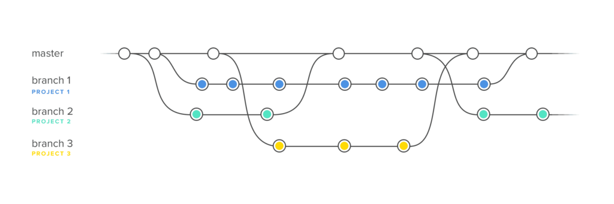

 
# Работа с Git
## 1. Проверка наличия установленного Git
В терминале выпольнить команду `git version`
Если Git установлен, появится сообщение с информацией о верси файла. Иначе будет сообщение об ошибке.
## 2. Установка Git
Загружаем последнюю версию Git с сайта https://git-scm.com/downloads.
Устанавливаем с настройками по умолчанию.
## 3. Настройка Git
При первом использовании Git необходимо представиться.
Для этого нужно ввести в терминале две команды:
```
git config --global user.name "Ваше имя"
git config --global user.email "почта@example.com"
```
## 4. Инициализация репозитория
Получить репозиторий можно двумя способами.
* В терминале преходим к папке, в которой хотим создать репозиторий.
Выполняем команду `git init` 
В исходной папке появится скрытая папка *.git*, содержащая все необходимые файлы репозитория - структуру Git репозитория.
* Клонировать существующий репозиторий Git из любого места.
Сделать это можно командой:
```
git clone <адрес репозитория>
```
## 5. Запись изменений в репозиторий
Чтобы посмотреть состояние файлов в репозитории необходимо выполнить команду:
```
git status
```
Для того, чтобы начать отслеживать новый файл используется команда
```
git add <имя файла с расширением>
```
## 6. Просмотр истории коммитов
Для просмотра истории коммитов используется команда:
```
git log
```
Данная команда перечисляет коммиты с их хэш-кодами, именем и электронной почтой, датой создания и сообщением коммита.
По умолчанию последие коммиты находятся вверху.

Для выхода из режима просмотра истории используется клавиша **"Q"**
## 7. Перемещение между сохранениями (коммитами)
Чтобы перейти к нужному сохранению (коммиту) можно использовать команду:
```
git checkout <хеш-код>
```
Пример использования команды `git checkout`:
```
git checkout 2f31c9e
```

Такой переход можно использовать только для просмотра!
Продолжить работу над файлом можно только после перхода на верх ветки командой:
``

## 8. Игнорирование файлов
Для того, чтобы игнорировать файлы и не отслеживать их Git-ом создается файл 
```.gitignore```. Он используется для того, чтобы определить, какие файлы и папки не нужно добавлять в git репозиторий.

Пример содержимого файла ```.gitignore```:

```#``` строки начинающиеся на # - это комментарии, они не учитываются

```*.a``` Исключить все файлы с расширение .a

```build/``` Игнорировать все файлы в каталоге build/

```doc/**/*.txt```Игнорировать все .txt файлы в каталоге doc/


## 9. Работа с ветками
<<<<<<< HEAD
Для  представления работы с ветками рассмотрим ниже приведенный рисунок.

Точки - это коммиты

Линия мастер - это основной проект(самые актуальные файлы)

Ветки 1,2,3 - ветки разработки основного проекта. 

Слияние веток 1,2,3 с веткой мастер - утверждение и выпуск разработанной версии основного проекта.

Команды при работе с  ветками

1. Для создания ветки используется команда 
    > git branch [имя ветки] 
2. Для просмотра количества созданных веток  используется команда 
    > git branch 

   >> При этом при выводе результата в терминале мы можем увидеть символ ```*```   Он говорит нам о том,что именно эта ветка выбрана в данный момент времени, и последующие коммиты будут фиксироваться в ней.
   
3. Для перехода в определенную ветку мы используем команду
    > git checkout [имя ветки]
4. Для удаления ветки используем команду 
    >git branch -d [имя ветки]
5. Для слияния веток мы используем  команду
    >git merge [имя ветки]
    >>Причем сливается ветка, на который вы находитесь в данный момент времени с веткой, которую прописали в команде merge.


## 10. Работа с удаленными репозиториями
Удалённые репозитории представляют собой версии вашего проекта, сохранённые в интернете или ещё где-то в сети. У вас может быть несколько удалённых репозиториев, каждый из которых может быть доступен для чтения или для чтения-записи. Взаимодействие с другими пользователями предполагает управление удалёнными репозиториями, а также отправку и получение данных из них. Управление репозиториями включает в себя как умение добавлять новые, так и умение удалять устаревшие репозитории, а также умение управлять различными удалёнными ветками, объявлять их отслеживаемыми или нет и так далее.

***1. Команда `git remote`***

 открывается список доступных удаленных репозиториев для работы.

***2. Команда `git remote add <shortname> <url>`*** 

добавление удаленного репозитория

 * `<Url>` берем с сайта GitHub, зайдя в удаленный репозиторий под вкладкой Code

Пример
* git remote add origin git@github.com:Goriachev/DDdoS-Attack.git
url>

***3. Команда `git remote remove`*** 

 Отключение удаленного репозитория от локального. 

Пример

* git remote remove <название удаленного репозитория>

***4. Команда `git remote show`***

выводит список всех подключенных удаленных репозиториев. Если передано имя репозитория, то выводит информацию об этом репозитории.

***Пример 1***
* $ git remote show

origin

upstream


***Пример 2***
* git remote show origin
remote origin

Fetch URL: git@github.com:smartiqaorg/geometric_lib.git

Push URL: git@github.com:smartiqaorg/geometric_lib.git

HEAD branch: develop

Remote branch:

develop new (next fetch will store in remotes/origin)

Local ref configured for 'git push':

dev pushes to develop (up to date)

***5. Команда `git clone <ссылка на удаленный репозиторий>`***

клонирует переданный репозиторий на ваш компьютер.

***Пример***

$ git сlone git@github.com:Goriachev/DDdoS-Attack.git

***6. Команда `git pull <ссылка на удаленный репозиторий>`***

используется для синхронизации  локальной рабочей копии и всех ссылочных объектов с удаленным репозиторием. Это все происходит с принудительным merge.Изменения скачиваются в локальный репозиторий.

***7. Команда `git fetch [имя удаленного репозитория] `***

Данная команда связывается с указанным удалённым проектом и забирает все те данные проекта, которых у вас ещё нет. После того как вы выполнили команду, у вас должны появиться ссылки на все ветки из этого удалённого проекта, которые вы можете просмотреть или слить в любой момент.

***8. Команда `git push [имя удаленного репозитория] [имя ветки]`***

Загружает изменения в удаленный репозиторий. 

***Пример***

$ git push origin develop
